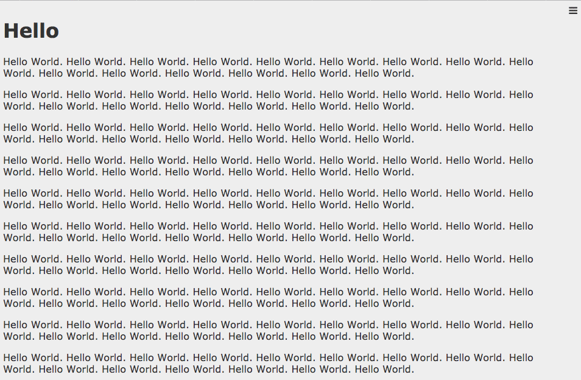

# dotinstall-hamberger-menu

[dotinstall](http://dotinstall.com/) lesson to create hamberger menu

Demo: [https://shgtkshruch.github.io/dotinstall-hamberger-menu/](https://shgtkshruch.github.io/dotinstall-hamberger-menu/)
